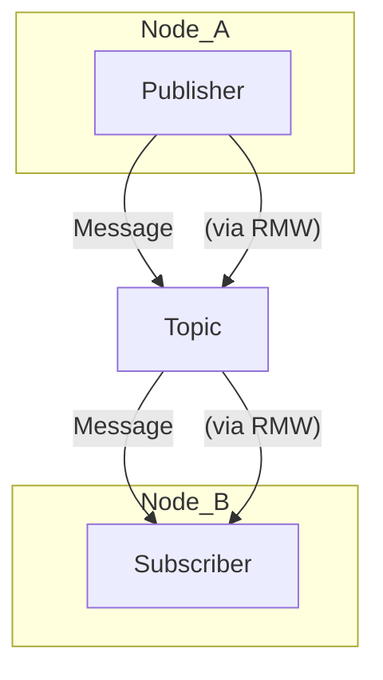

## ROS 2 Nodes

In ROS 2, a **Node** is an executable process that performs computations. Nodes are the fundamental building blocks of a ROS 2 system, acting as a modular unit for specific functionalities. Each node is designed to do "one thing well," promoting code reusability and system robustness. For example, in a robotic system, you might have separate nodes for:

*   Reading sensor data (e.g., a LiDAR node)
*   Processing image data (e.g., an image processing node)
*   Controlling motors (e.g., a motor control node)
*   Planning paths (e.g., a navigation node)

Nodes communicate with each other using various ROS 2 communication mechanisms, primarily Topics, Services, and Actions. This modular architecture allows developers to build complex robotic applications by combining many smaller, specialized nodes.

### Key Characteristics of ROS 2 Nodes:

*   **Modular**: Each node has a single, well-defined responsibility.
*   **Independent**: Nodes can run independently and communicate with each other.
*   **Language Agnostic**: Nodes can be implemented in different programming languages (e.g., C++, Python), thanks to client libraries like `rclcpp` (C++) and `rclpy` (Python).
*   **Configurable**: Nodes can be configured through parameters at runtime.

### Example of a Minimal ROS 2 Node (Python):

To illustrate a basic ROS 2 node, consider a simple "talker" node that continuously publishes a "Hello ROS 2!" message to a topic.

```python
import rclpy
from rclpy.node import Node
from std_msgs.msg import String

class MinimalPublisher(Node):
    def __init__(self):
        super().__init__('minimal_publisher')
        self.publisher_ = self.create_publisher(String, 'topic', 10)
        timer_period = 0.5  # seconds
        self.timer = self.create_timer(timer_period, self.timer_callback)
        self.i = 0

    def timer_callback(self):
        msg = String()
        msg.data = 'Hello ROS 2: %d' % self.i
        self.publisher_.publish(msg)
        self.get_logger().info('Publishing: "%s"' % msg.data)
        self.i += 1

def main(args=None):
    rclpy.init(args=args)
    minimal_publisher = MinimalPublisher()
    rclpy.spin(minimal_publisher)
    minimal_publisher.destroy_node()
    rclpy.shutdown()

if __name__ == '__main__':
    main()
```

This node defines a `MinimalPublisher` class that inherits from `rclpy.node.Node`. It initializes a publisher to send `String` messages to a topic named 'topic' and uses a timer to call `timer_callback` every 0.5 seconds, incrementing a counter and publishing the message.

---
**Citation**: ROS 2 Documentation. (n.d.). _Concepts: Nodes_. Retrieved from [https://docs.ros.org/en/humble/Concepts/About-Nodes.html](https://docs.ros.org/en/humble/Concepts/About-Nodes.html) (Example code adapted from official ROS 2 tutorials).

## ROS 2 Topics

**Topics** are the primary mechanism for asynchronous, many-to-many, publish-subscribe communication in ROS 2. Nodes use topics to exchange data streams. A node that wants to share data publishes messages to a topic, and any node interested in that data subscribes to that topic to receive the messages.

This communication model is:

*   **Asynchronous**: Publishers and subscribers don't need to be running at the same time or have direct knowledge of each other.
*   **Decoupled**: Publishers and subscribers are separate entities, reducing direct dependencies between parts of the system.
*   **Many-to-many**: Multiple publishers can send data to the same topic, and multiple subscribers can receive data from the same topic.

Messages sent over topics are typed. This means that both the publisher and subscriber must agree on the type of data being sent (e.g., std_msgs/String, geometry_msgs/Twist). This ensures data consistency and integrity.

### Example of a Minimal ROS 2 Subscriber (Python):

To complement the "talker" node, here's a simple "listener" node that subscribes to the 'topic' and prints the received messages.

`python
import rclpy
from rclpy.node import Node
from std_msgs.msg import String

class MinimalSubscriber(Node):
    def __init__(self):
        super().__init__('minimal_subscriber')
        self.subscription = self.create_subscription(
            String,
            'topic',
            self.listener_callback,
            10)
        self.subscription  # prevent unused variable warning

    def listener_callback(self, msg): # Added msg argument here
        self.get_logger().info('I heard: "%s"' % msg.data)

def main(args=None):
    rclpy.init(args=args)
    minimal_subscriber = MinimalSubscriber()
    rclpy.spin(minimal_subscriber)
    minimal_subscriber.destroy_node()
    rclpy.shutdown()

if __name__ == '__main__':
    main()
`

When the MinimalPublisher (talker) and MinimalSubscriber (listener) nodes are run concurrently, the listener node will continuously print the "Hello ROS 2!" messages published by the talker.

---
**Citation**: ROS 2 Documentation. (n.d.). _Concepts: Topics_. Retrieved from [https://docs.ros.org/en/humble/Concepts/About-Topics.html](https://docs.ros.org/en/humble/Concepts/About-Topics.html) (Example code adapted from official ROS 2 tutorials).

## ROS 2 Services

**Services** in ROS 2 provide a request/response communication model, which is synchronous and designed for one-to-one interactions. Unlike topics, where data flows continuously, services are used when a node needs to trigger an action or retrieve information from another node and receive a direct response.

This communication model is:

*   **Synchronous**: The client node sends a request and blocks (waits) until it receives a response from the service server.
*   **One-to-one**: A single client sends a request to a single service server.
*   **Request/Response**: The communication involves a request message from the client and a response message from the server.

Services are defined by .srv files, which specify the structure of both the request and response messages. This ensures that both the client and server agree on the data types exchanged.

### Example of a Minimal ROS 2 Service (Python):

Consider a simple service that adds two integers.

#### 1. Define the Service Interface (example_interfaces/srv/AddTwoInts.srv):

`
int64 a
int64 b
---
int64 sum
`

#### 2. Service Server Node (dd_two_ints_server.py):

`python
import rclpy
from rclpy.node import Node
from example_interfaces.srv import AddTwoInts

class MinimalService(Node):
    def __init__(self):
        super().__init__('minimal_service')
        self.srv = self.create_service(AddTwoInts, 'add_two_ints', self.add_two_ints_callback)

    def add_two_ints_callback(self, request, response):
        response.sum = request.a + request.b
        self.get_logger().info('Incoming request: a: %d b: %d' % (request.a, request.b))
        self.get_logger().info('Sending back response: [%d]' % response.sum)
        return response

def main(args=None):
    rclpy.init(args=args)
    minimal_service = MinimalService()
    rclpy.spin(minimal_service)
    rclpy.shutdown()

if __name__ == '__main__':
    main()
`

#### 3. Service Client Node (dd_two_ints_client.py):

`python
import sys
import rclpy
from rclpy.node import Node
from example_interfaces.srv import AddTwoInts

class MinimalClientAsync(Node):
    def __init__(self):
        super().__init__('minimal_client_async')
        self.cli = self.create_client(AddTwoInts, 'add_two_ints')
        while not self.cli.wait_for_service(timeout_sec=1.0):
            self.get_logger().info('service not available, waiting again...')
        self.req = AddTwoInts.Request()

    def send_request(self, a, b):
        self.req.a = a
        self.req.b = b
        self.future = self.cli.call_async(self.req)
        rclpy.spin_until_future_complete(self, self.future)
        return self.future.result()

def main(args=None):
    rclpy.init(args=args)
    minimal_client = MinimalClientAsync()
    response = minimal_client.send_request(int(sys.argv[1]), int(sys.argv[2]))
    minimal_client.get_logger().info('Result of add_two_ints: for %d + %d = %d' %
                                  (minimal_client.req.a, minimal_client.req.b, response.sum))
    minimal_client.destroy_node()
    rclpy.shutdown()

if __name__ == '__main__':
    main()
`

---
**Citation**: ROS 2 Documentation. (n.d.). _Concepts: Services_. Retrieved from [https://docs.ros.org/en/humble/Tutorials/Beginner-CLI-Tools/Writing-A-Simple-Service-And-Client-Py.html](https://docs.ros.org/en/humble/Tutorials/Beginner-CLI-Tools/Writing-A-Simple-Service-And-Client-Py.html) (Example code adapted from official ROS 2 tutorials).

## ROS 2 Node Communication Diagram

```mermaid
graph TD
    subgraph Node A
        Publisher_A --> Topic_X
    end

    subgraph Node B
        Topic_X --> Subscriber_B
    end

    subgraph Node C
        Publisher_C --> Topic_Y
        Topic_X --> Subscriber_C
    end

    subgraph Node D
        Topic_Y --> Subscriber_D
    end

    Node A -- publishes to --> Topic_X
    Node B -- subscribes from --> Topic_X
    Node C -- publishes to --> Topic_Y
    Node C -- subscribes from --> Topic_X
    Node D -- subscribes from --> Topic_Y
```

## ROS 2 Message Flow Diagram


