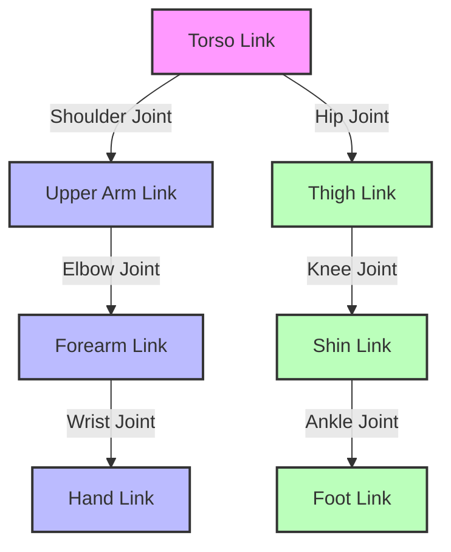

# Humanoid URDF Basics

The **Unified Robot Description Format (URDF)** is an XML format used in ROS to describe all aspects of a robot. It's a powerful tool for defining the kinematic and dynamic properties of a robot, as well as its visual representation. For humanoid robots, URDF is essential for modeling their complex articulated structures.

A URDF model is built from two primary elements:

1.  **`<link>` elements**: Represent the rigid bodies of the robot. These are the physical parts that make up the robot, such as a torso, an upper arm, a forearm, a hand, etc. Each link has properties like:
    *   **`visual`**: Defines the graphical appearance of the link (e.g., mesh file, color).
    *   **`inertial`**: Defines the physical properties like mass, center of mass, and inertia tensor.
    *   **`collision`**: Defines the collision geometry for physics simulation.

2.  **`<joint>` elements**: Represent the connections between links. Joints define how links are attached to each other and their degrees of freedom. Common types of joints include:
    *   **`revolute`**: A rotating joint with one degree of freedom (e.g., elbow, knee).
    *   **`continuous`**: Similar to revolute but without joint limits (e.g., a wheel).
    *   **`prismatic`**: A sliding joint with one translational degree of freedom (e.g., a linear actuator).
    *   **`fixed`**: A rigid connection between two links, removing all degrees of freedom.

### Basic Humanoid Structure (Conceptual)

A simplified humanoid robot could be described with a few links and joints:

*   **Links**: `base_link` (torso), `upper_arm_link`, `forearm_link`, `hand_link`, `thigh_link`, `shin_link`, `foot_link`.
*   **Joints**: `torso_to_upper_arm_joint`, `upper_arm_to_forearm_joint`, `forearm_to_hand_joint`, `torso_to_thigh_joint`, `thigh_to_shin_joint`, `shin_to_foot_joint`.

Each joint would connect two links and specify their relative motion. For instance, an `elbow_joint` (revolute type) would connect the `upper_arm_link` to the `forearm_link`.

### Example URDF Snippet (Conceptual):

```xml
<?xml version="1.0"?>
<robot name="simple_humanoid">

  <link name="base_link">
    <visual>
      <geometry><box size="0.2 0.4 0.6"/></geometry>
    </visual>
    <collision>
      <geometry><box size="0.2 0.4 0.6"/></geometry>
    </collision>
    <inertial>
      <mass value="10.0"/>
      <origin xyz="0 0 0"/>
      <inertia ixx="1.0" ixy="0.0" ixz="0.0" iyy="1.0" iyz="0.0" izz="1.0"/>
    </inertial>
  </link>

  <link name="upper_arm_link">
    <visual>
      <geometry><cylinder radius="0.05" length="0.3"/></geometry>
    </visual>
    <collision>
      <geometry><cylinder radius="0.05" length="0.3"/></geometry>
    </collision>
    <inertial>
      <mass value="1.0"/>
      <origin xyz="0 0 0.15"/>
      <inertia ixx="0.01" ixy="0.0" ixz="0.0" iyy="0.01" iyz="0.0" izz="0.01"/>
    </inertial>
  </link>

  <joint name="shoulder_joint" type="revolute">
    <parent link="base_link"/>
    <child link="upper_arm_link"/>
    <origin xyz="0 0.2 0.3" rpy="0 0 0"/>
    <axis xyz="0 1 0"/>
    <limit lower="-1.57" upper="1.57" effort="100" velocity="10"/>
  </joint>

  <!-- ... more links and joints would follow for a full humanoid ... -->

</robot>

## Simple Humanoid Model Diagram (Conceptual)


