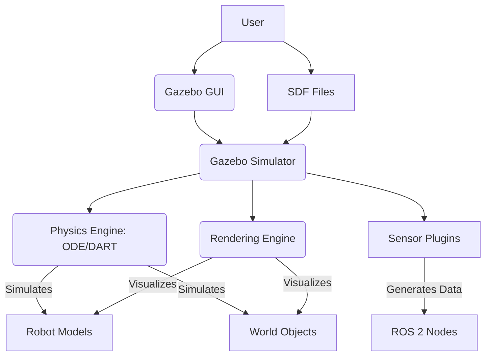

# Gazebo Physics and Environment Setup

**Gazebo** is an open-source 3D robotics simulator that provides the ability to accurately and efficiently simulate populations of robots in complex indoor and outdoor environments. It offers a robust physics engine, high-quality graphics, and convenient programmatic interfaces, making it a powerful tool for developing and testing robotic systems.

### Physics Simulation

Gazebo utilizes powerful physics engines to realistically simulate robot dynamics and interactions within an environment. The default physics engine is usually ODE (Open Dynamics Engine), but Gazebo also supports others like DART and Simbody. Key aspects of physics simulation in Gazebo include:

*   **Gravity**: All objects within the simulation are subject to gravitational forces, which can be configured (e.g., standard Earth gravity).
*   **Collisions**: Gazebo accurately detects and resolves collisions between simulated objects, preventing interpenetration and applying realistic contact forces. Defining proper collision geometries for robot links and environmental objects is crucial for realistic interaction.
*   **Joints**: Robot joints are simulated with their specified limits, velocities, and torques, allowing for realistic manipulation and locomotion.

### Environment Setup

Building a simulation environment in Gazebo involves defining the world, including static objects (e.g., walls, tables), dynamic objects (e.g., cubes, spheres), and light sources. Environments can be created using:

*   **SDF (Simulation Description Format)**: The primary XML format for describing worlds, robots, and other objects in Gazebo. SDF files can define models, physics properties, sensors, and plugins.
*   **Gazebo GUI**: An interactive interface that allows users to insert models from a database, manipulate objects, and configure properties directly.
*   **Programmatic methods**: Via ROS 2 or other APIs, allowing for dynamic creation and modification of environments.

### Example: Simple Gazebo World (Conceptual SDF)

Here's a conceptual snippet of an SDF world file defining a simple environment with a ground plane and a box.

```xml
<?xml version="1.0" ?>
<sdf version="1.7">
  <world name="default">
    <gravity>0 0 -9.8</gravity> <!-- Standard Earth gravity -->

    <!-- Ground Plane -->
    <include>
      <uri>model://ground_plane</uri>
    </include>

    <!-- Sun Light -->
    <include>
      <uri>model://sun</uri>
    </include>

    <!-- A simple box -->
    <model name="my_box">
      <pose>0 0 0.5 0 0 0</pose>
      <link name="box_link">
        <collision name="collision">
          <geometry>
            <box>
              <size>1 1 1</size>
            </box>
          </geometry>
        </collision>
        <visual name="visual">
          <geometry>
            <box>
              <size>1 1 1</size>
            </box>
          </geometry>
        </visual>
        <inertial>
          <mass>1.0</mass>
          <inertia>
            <ixx>0.166667</ixx>
            <iyy>0.166667</iyy>
            <izz>0.166667</izz>
          </inertia>
        </inertial>
      </link>
    </model>
  </world>
</sdf>

## Gazebo Simulation Environment Diagram (Conceptual)


