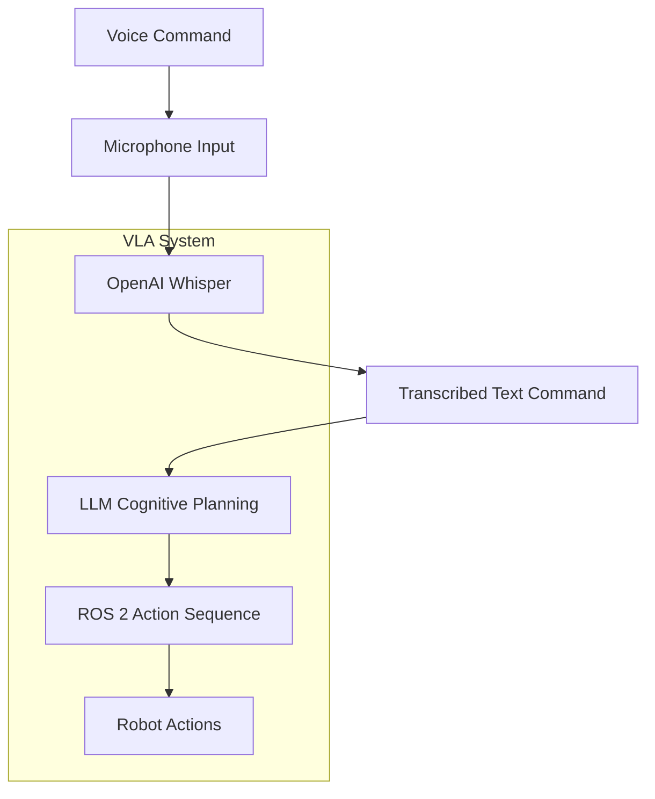

# Voice Command Recognition (OpenAI Whisper)

**OpenAI Whisper** is a robust speech recognition model trained on a large dataset of diverse audio. Its ability to accurately transcribe speech into text makes it an invaluable component in Vision-Language-Action (VLA) systems, enabling robots to understand and respond to natural language commands.

### How OpenAI Whisper Works

Whisper is a neural network model that can perform:

*   **Multilingual Speech Recognition**: It can transcribe speech in multiple languages.
*   **Speech Translation**: It can translate speech from one language into English.
*   **Language Identification**: It can identify the language being spoken.

For VLA systems, the primary function is accurate speech-to-text transcription. When a human gives a voice command, Whisper converts that auditory input into a textual representation, which can then be processed by other components of the VLA pipeline.

### Role in VLA Systems

In a VLA system, Whisper acts as the crucial bridge between human natural language input and the robot's cognitive and action planning modules. Its high accuracy helps in reducing errors in command interpretation, leading to more reliable robot behavior.

The typical flow for voice commands in VLA:

1.  **Audio Input**: A microphone captures the human voice command.
2.  **Whisper Processing**: The audio data is fed to the OpenAI Whisper model.
3.  **Text Transcription**: Whisper outputs the transcribed text of the command.
4.  **LLM Processing**: The text command is then passed to a Large Language Model (LLM) for cognitive planning (covered in the next chapter).

### Example: Conceptual OpenAI Whisper Integration (Python Snippet)

While a full executable integration would involve API calls and audio handling, here's a conceptual Python snippet demonstrating how Whisper might be used.

```python
# Conceptual Python Snippet for OpenAI Whisper integration
# import openai
# import soundfile as sf

# def transcribe_audio_with_whisper(audio_file_path):
#     with open(audio_file_path, "rb") as audio_file:
#         # response = openai.Audio.transcribe("whisper-1", audio_file)
#         # transcribed_text = response["text"]
#         transcribed_text = "Move forward ten centimeters." # Simulated transcription
#         print(f"Transcribed: {transcribed_text}")
#         return transcribed_text

# if __name__ == "__main__":
#     # Simulate audio input
#     # dummy_audio_file = "path/to/your/audio.wav"
#     # sf.write(dummy_audio_file, [0.0]*16000, 16000) # Create a dummy WAV file
#     # transcribed_command = transcribe_audio_with_whisper(dummy_audio_file)
#     
#     # Or directly use a simulated transcribed command
#     transcribed_command = "Go to the kitchen and fetch the red apple."
#     print(f"Simulated command for LLM: '{transcribed_command}'")
#     # This 'transcribed_command' would then be sent to an LLM for planning
```

---
**Citation**: OpenAI. (n.d.). _Whisper_. Retrieved from [https://openai.com/research/whisper](https://openai.com/research/whisper) (Conceptual adaptation).

## Voice-to-Action Flow Diagram (Conceptual)


